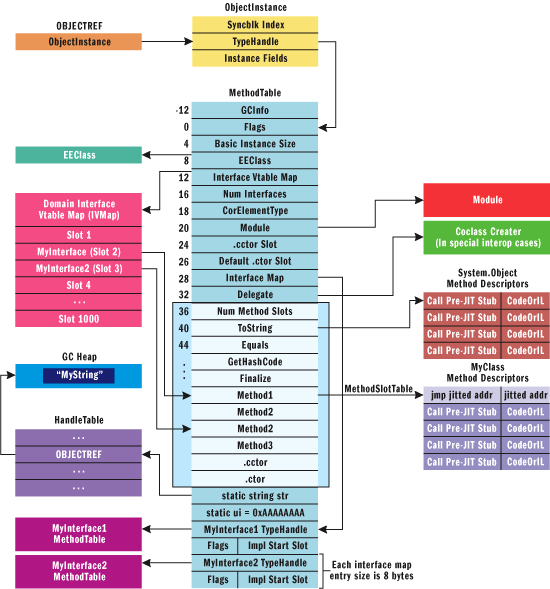
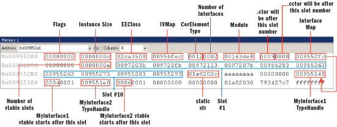
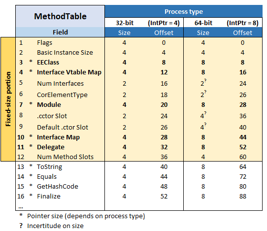
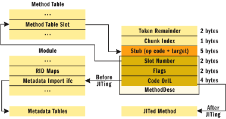

## MethodRedirect

MethodRedirect is a `MethodInfo` extension written in C# that can be used to redirect a method call to another using reflection. 

This implementation uses marshalling to modify the address of the corresponding *Method Descriptor* without the need to use *unsafe* block.

This project was inspired by [one of the answers](https://stackoverflow.com/a/55026523/5953306) given for [this question](https://stackoverflow.com/questions/7299097/dynamically-replace-the-contents-of-a-c-sharp-method) on StackOverflow about replacing the content of a C# method. The answer did not provide sufficient explanation on how it actually works and neither shows an example of its usage.The following are development notes and references used to implement this project and hopefully explain how it works too.

##### From the CLR documentation:

  - Each MethodDesc has a slot, which contains the entry point of the method. The slot and entry point must exist for all methods, even the ones that never run like abstract methods.

  - The slot is either in `MethodTable` or in `MethodDesc` itself. The location of the slot is determined by `mdcHasNonVtableSlot` bit on `MethodDesc`.

  - The slot is stored in `MethodTable` for methods that require efficient lookup via slot index, e.g. virtual methods or methods on generic types. The `MethodDesc` contains the slot index to allow fast lookup of the entry point in this case.

  - Each class and interface will be represented in memory by a `MethodTable` (MT) data structure. A pointer to the `MethodTable` can be acquired through the `Type.RuntimeTypeHandle` property. The `TypeHandle` (contained in the `ObjectInstance`) points to an offset from the beginning of the `MethodTable`. This offset is 12 bytes by default.
    
	##### MethodTable

    

    Embedded within the `MethodTable` is a table of slots that point to the respective method descriptors (`MethodDesc`), enabling the behavior of the type. The `Method Slot Table` is created based on the linearized list of implementation methods laid out in the following order:

        1. Inherited virtuals
        2. Introduced virtuals
        3. Instance methods
        4. Static methods

    **The first four methods of any type will always be `ToString()`, `Equals()`, `GetHashCode()`, and `Finalize()`** in this order. On x86, each method's address is represented on  4 bytes. On  x64 build,  each method's address is represented on 8 bytes.
    
      - On x86 build, the fixed-size portion of `MethodTable` is 40 bytes.
      - On x64 build, the fixed-size portion of `MethodTable` is 64 bytes.

    The object constructor (.ctor) is automatically generated by the C# compiler for all objects having no constructor explicitly defined.

    The class constructor (.cctor) is generated by the C# compiler when at least one static variable is defined.

    ##### MethodTable Layout Example

    
       
    

    ##### Method Descriptor

    

    - Method Descriptor (`MethodDesc`) is an encapsulation of method implementation as the CLR knows it.

    - Each `MethodDesc` is padded with a `PreJitStub`, which is responsible for triggering JIT compilation. 

    - The method table slot entry actually points to the stub instead of the actual MethodDesc data structure. This is at a negative offset of 5 bytes from the actual `MethodDesc` and is part of **the 8-byte padding every method inherits**.

    - `MethodDesc` is always 5 bytes after the location pointed by the `Method Slot Table` entry. After the compilation is complete, the 5 bytes containing the call instruction will be overwritten with an unconditional jump to the JIT-compiled code.

    - The `Flags` field in the method descriptor is encoded to contain the information about the type of the method, such as static, instance, interface method, or COM implementation. The `Flags` field is represented on 3-bit [0-7] and can be one of the [MethodClassification](https://github.com/dotnet/coreclr/blob/master/src/vm/method.hpp#L90) enumeration value.

    	[**UPDATE**] *The method descriptor structure shows a `Slot Number` field of 2 bytes, which correspond to a maximum of 255 per type. This must be incorrect as this number can be much larger. A reasonable assumption is that the field must take 3 bytes by using the first byte of the following `Flags` field.*

#### References

   - [.NET Framework Internals: How the CLR Creates Runtime Objects](https://docs.microsoft.com/en-us/archive/msdn-magazine/2005/may/net-framework-internals-how-the-clr-creates-runtime-objects)
   - [Method Descriptor](https://github.com/dotnet/coreclr/blob/master/Documentation/botr/method-descriptor.md)
   - [Dynamically replace the contents of a C# method?](https://stackoverflow.com/questions/7299097/dynamically-replace-the-contents-of-a-c-sharp-method) 
   - [The VTABLE](https://github.com/dotnet/coreclr/blob/master/src/vm/methodtable.h#L1464)
   - [CLR implementation of virtual method calls to interface members](https://stackoverflow.com/questions/9808982/clr-implementation-of-virtual-method-calls-to-interface-members)
   - [Exploiting C++ VTABLES: Instance Replacement](https://defuse.ca/exploiting-cpp-vtables.htm)
   - ["Stubs" in the .NET Runtime](https://mattwarren.org/2019/09/26/Stubs-in-the-.NET-Runtime/)
   - [Custom memory allocation in C#](https://blog.adamfurmanek.pl/2016/05/07/custom-memory-allocation-in-c-part-3/)
   - [CLR runtime details-Method Descriptor](https://www.programmersought.com/article/53334314040/) 

---
        
## [MIT](http://opensource.org/licenses/MIT) License

Permission is hereby granted, free of charge, to any person obtaining a copy of this software and associated documentation files (the "Software"), to deal in the Software without restriction, including without limitation the rights to use, copy, modify, merge, publish, distribute, sublicense, and/or sell copies of the Software, and to permit persons to whom the Software is furnished to do so, subject to the following conditions:

The above copyright notice and this permission notice shall be included in all copies or substantial portions of the Software.

THE SOFTWARE IS PROVIDED "AS IS", WITHOUT WARRANTY OF ANY KIND, EXPRESS OR IMPLIED, INCLUDING BUT NOT LIMITED TO THE WARRANTIES OF MERCHANTABILITY, FITNESS FOR A PARTICULAR PURPOSE AND NONINFRINGEMENT. IN NO EVENT SHALL THE AUTHORS OR COPYRIGHT HOLDERS BE LIABLE FOR ANY CLAIM, DAMAGES OR OTHER LIABILITY, WHETHER IN AN ACTION OF CONTRACT, TORT OR OTHERWISE, ARISING FROM, OUT OF OR IN CONNECTION WITH THE SOFTWARE OR THE USE OR OTHER DEALINGS IN THE SOFTWARE.